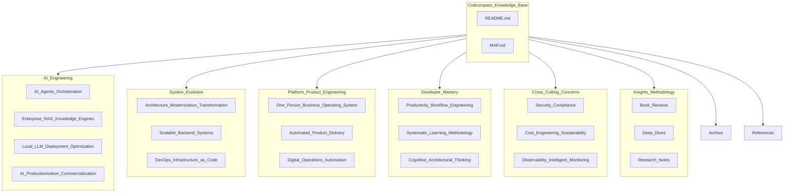

# Codcompass 2.0 · Structural Map

## Reading Order (non-prescriptive)

1. Anchor the **business or reliability constraint** (Cross-Cutting or Platform).
2. Choose the **system class** you are evolving (AI Engineering vs System Evolution).
3. Upgrade **personal leverage** (Developer Mastery) so execution stays honest at scale.
4. Use **Insights** to stress-test assumptions; park drift in **Archive** with dated context.
