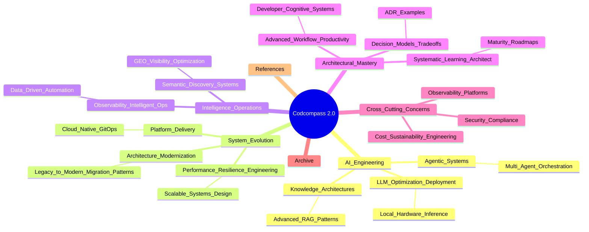
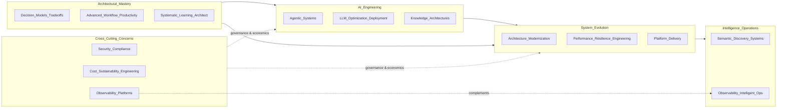

# Codcompass 2.0 — Structure Map

Relationships: **Intelligence_Operations** emphasizes *semantic discovery and intelligent ops loops*; **Cross_Cutting_Concerns / Observability_Platforms** complements with *shared telemetry foundations, governance, and platform contracts*—not duplicate ownership.

